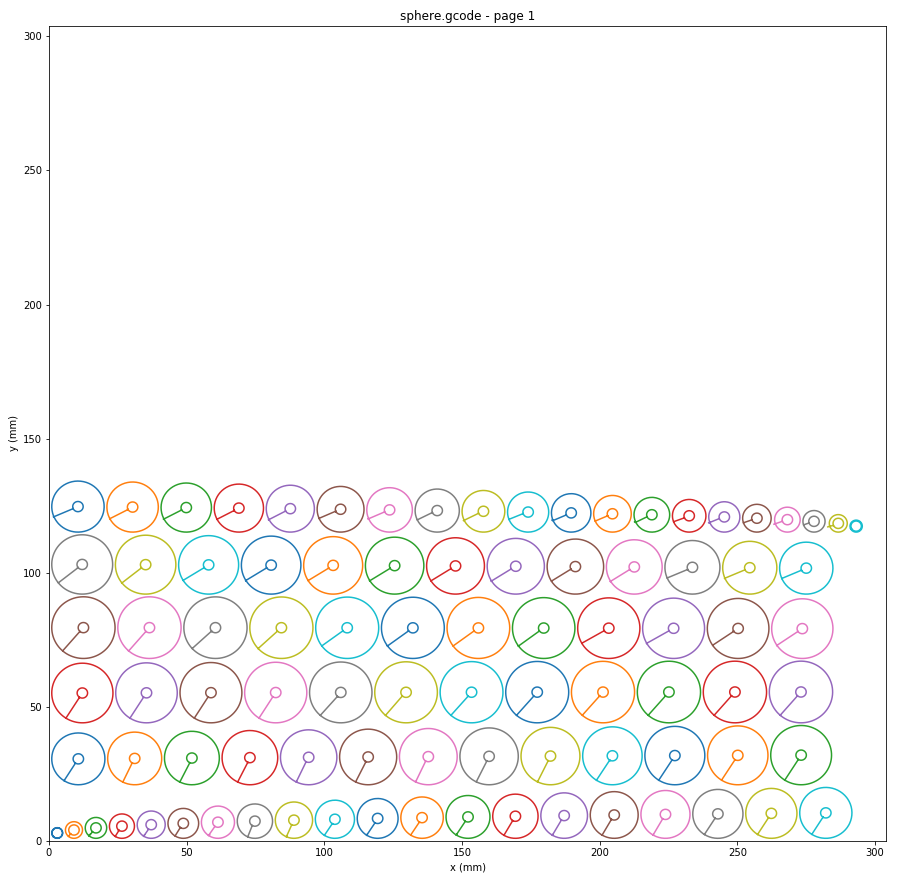

<a href="/index">

</a>

## 3D to 2D G-code Optimizing Tool

##### Jupyter Notebook
---
### Background:

Since 2015, I have been working on a homemade CNC Laser Cutter. The 2 Watt laser is capable of cutting though thick paper, 3/16" foamcore, and balsa wood with enough passes. This is great for making 2 dimensional art or cutting things down to exact sizes, but not great for 3 dimensional structures. In order to solve this problem, I turned to inspiration from 3D printing, which is nothing more than a series of (roughly) 2-dimensional layers stacked on top of each other. Cutting out these layers and stacking them together was a viable option. Using thicker materials would reduce the number of layers needed, but also reduce the Z-axis resolution of the 3D object.

### Process:

#### Fusion 360 CAD Model

The first step in the process involved using Autodesk Fusion 360 to draw a CAD model of the desired shape. I chose to start with a simple design: a cardstock sphere with a hole running through it to put on an alignment bolt. An .STL file was created from the model below.

<p align="center">
  
</p>

#### Cura Slicing

Next, the STL needed to be sliced. While I could have just created a python file to slice and optimize, it was much simpler to use tools that were open source and already available. I created a custom printer and updated settings until I got the results I desired: no infill needed, just an outline of all of the surfaces. The resulting slicing is shown below.

<p align="center">
  
</p>

#### Python G-Code Parsing

Now, I had the files that I needed to create my 3D layered sphere. Ignoring the Z-Axis, since my laser cutter is only 2-axis, the resulting [g-code file](sphere.gcode) is a series of concentric circles around the middle of the cutting plate.

<p align="center">
  
</p>

In order to parse the g-code file, I create a class called unSlicer2D which opens the recently sliced Cura g-code file. It immediately performs a few string operations to remove unneeded data from the original file.

```python
class unSlicer2D:
    def __init__(self, file):
        '''
        the x and y argument are the size of the laser bed in mm
        the buffer is the relative distance between each layer, treated as a rectange of size (x max - min) by (y max - min)
        this will not optimize the size needed to cut all layers, but will lay them all out into a cuttable configuration. 
        '''
        
        with open(file) as c:
            self.code = c.readlines()
        self.file = file
        self.code = [i.split(' E0')[0].split(' Z')[0] for i in self.code] # remove unneeded info
        self.num = [int(i.split(':')[-1].strip('\n')) for i in self.code if ";LAYER_COUNT:" in i][0]
        self.ranges = [self.code.index(';LAYER:{}\n'.format(i)) for i in range(self.num)]
        self.ranges.append(-1)
        self.layers = {i:Layer(self.code[self.ranges[i]:self.ranges[i+1]]) for i in range(self.num)} # Split the layers into separate instances
        self.pages = 1
```
During the initial parsing of the g-code file, each layer is separated into a new class object called Layer. This allows the program to make sure that each physical shape from the sliced object is kept together, and moved all together. maX and miX are max and min X values within the layer, respectively. Same for maY and miY in the Y direction.
```python
class Layer:
    def __init__(self, gcode):
        self.gcode = gcode
        self.lines = {num : Code(line) for num,line in enumerate(self.gcode)}
        self.page = 0
        self()
        
    def __call__(self):
        self.maX = max([x.X for x in self.lines.values() if x.X is not None])
        self.miX = min([x.X for x in self.lines.values() if x.X is not None])
        self.maY = max([y.Y for y in self.lines.values() if y.Y is not None])
        self.miY = min([y.Y for y in self.lines.values() if y.Y is not None])
```
Within the Layer setup, another class object called Code is created for each individual g-code line within each layer in order to keep the code processing as organized and clean as possible. Each line of code in the original g-code file is added as a Code object to the Layer object that it is assigned to. It saves the key values of a g-code line: the G, F, X and Y values. 
```python
class Code:
    def __init__(self, gcode):
        self.gcode = gcode
        self.G = None
        self.F = None
        self.X = None
        self.Y = None
        self.splitter()
        
    def splitter(self):
        if ';' in self.gcode: # this is a comment line and can be ignored
            return
        c1 = self.gcode.split(' ')
        g = [i for i in c1 if 'G' in i]
        f = [float(i.strip('F')) for i in c1 if 'F' in i]
        x = [float(i.strip('X')) for i in c1 if 'X' in i]
        y = [float(i.strip('Y')) for i in c1 if 'Y' in i]
        
        if len(g) > 0:
            self.G = g[0]
        if len(f) > 0:
            self.F = f[0]
        if len(x) > 0:
            self.X = x[0]
        if len(y) > 0:
            self.Y = y[0]
```

#### G-Code Optimization

Now that python had a model of the g-code data that was usable, the next step was to optimize the shapes to make as many fit onto the cutting plate without overlap as possible. A function was added to the unSlicer2D class called Optimize(). This function moves all of the shapes by layer to a new position away from the origin in the bottom left corner. The arguments max_x and max_y are the size of the material that is being cut, in mm. It defaults to 304mm because the laser is 12"x12". The buffer argument is the amount of space left between shapes and from the edge of the material. 

```python
    def Optimize(self, max_x=304, max_y=304, buffer=0):
        # step 1: move all layers to the origin
        for num in range(self.num):
            self.shifter(self.layers[num],dx=-self.layers[num].miX, dy=-self.layers[num].miY)                
        # step 2: move one by one to fit grid         
        # move 0th layer first
        self.shifter(self.layers[0],dx=buffer, dy=buffer)        
        x = self.layers[0].maX+buffer
        y = buffer
        my = self.layers[0].maY
        page = 0 # if there are more things than fit on one page        
        for num in range(1,self.num):            
            if x + self.layers[num].maX + buffer >= max_x:
                x = buffer
                y = my + buffer
                my = 0                
            else:
                x = self.layers[num-1].maX+buffer            
            if y + self.layers[num].maY + buffer >= max_y:
                page += 1
                y = buffer
                x = buffer                  
            self.shifter(self.layers[num],dx=x, dy=y)            
            self.layers[num].page = page        
            x = self.layers[num].maX+buffer            
            if self.layers[num].maY > my:
                my = self.layers[num].maY  
        self.pages = page + 1
```
The resulting optimization is oddly satisfying:

<p align="center">
  
</p>

#### Exporting Optimized G-Code

With the hard parts done, all that was left was to render a new g-code file for the optimized version. A simple for loop made the file quickly and efficiently from a new function within unSlicer2d called Generate(). This operation generated [this optimized g-code file](0_laser_sphere.gcode).

```python
def Generate(self, file='test.gcode', passes=1, F=1000, S=1000):
        for pg in range(self.pages):
            f = open('{}_{}'.format(pg,file),'w')

            f.write('; Mount Zirkel Design G-Code Generator\n')
            f.write('; {}\n'.format(file))
            f.write('; file {} of {}\n\n'.format(pg+1, self.pages))
            f.write('S{}M3M8F{}\n'.format(S,F))
            f.write('\n')
            for p in range(passes):
                for layer in self.layers.values():
                    if layer.page == pg:
                        for line in layer.lines.values():
                            flag = False
                            if line.G is not None:
                                f.write(f'{line.G} ')
                                flag = True
                            if line.X is not None:
                                f.write(f'X{line.X} ')
                                flag = True
                            if line.Y is not None:
                                f.write(f'Y{line.Y}')
                                flag = True
                            if flag:
                                f.write('\n')
            f.write('\n; shut down laser, turn off fans\n')
            f.write('S0M5M9\n')
            f.write('; end of file')
            f.close()
```

#### Results

Running the new g-code file on my laser, I was pleasantly surprised with the results: a 90 layer sphere made out just math and paper!

<p align="center">
  
</p>

This program is remarkably useful for simple 3D objects!
