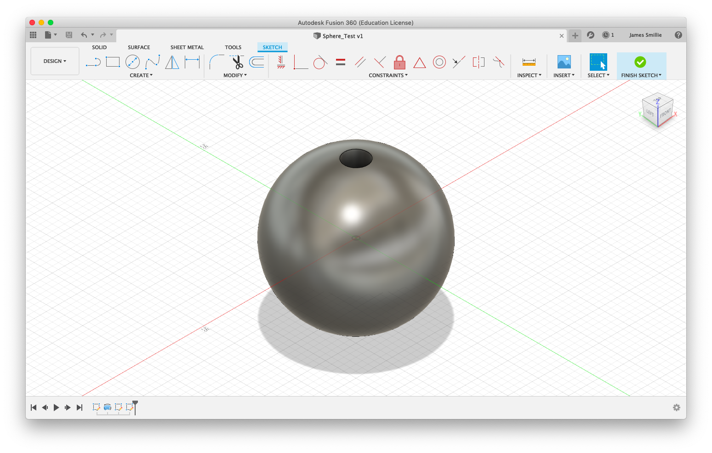
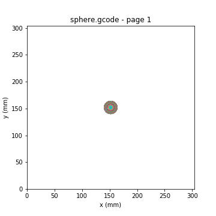

## 3D to 2D G-code Optimizing Tool

##### Jupyter Notebook
---
### Background:

Since 2015, I have been working on a homemade CNC Laser Cutter. The 2 Watt laser is capable of cutting though thick paper, 3/16" foamcore, and balsa wood with enough passes. This is great for making 2 dimensional art or cutting things down to exact sizes, but not great for 3 dimensional structures. In order to solve this problem, I turned to inspiration from 3D printing, which is nothing more than a series of (roughly) 2-dimensional layers stacked on top of each other. Cutting out these layers and stacking them together was a viable option. Using thicker materials would reduce the number of layers needed, but also reduce the Z-axis resolution of the 3D object.

### Process:

#### Fusion 360 CAD Model

The first step in the process involved using Autodesk Fusion 360 to draw a CAD model of the desired shape. I chose to start with a simple design: a cardstock sphere with a hole running through it to put on an alignment bolt. An .STL file was created from the model below.

  

#### Cura Slicing

Next, the STL needed to be sliced. While I could have just created a python file to slice and optimize, it was much simpler to use tools that were open source and already available. I created a custom printer and updated settings until I got the results I desired: no infill needed, just an outline of all of the surfaces. The resulting slicing is shown below.

  

#### Python G-Code Parsing

Now, I had the files that I needed to create my 3D layered sphere. 

  

---
### Implementation
