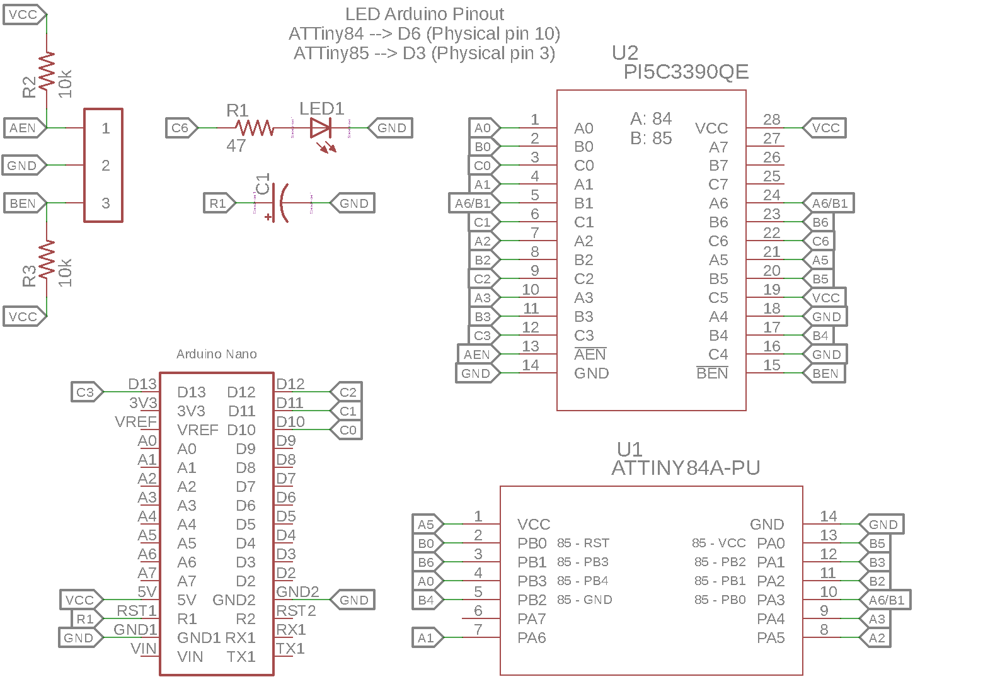

# ATTiny84/85 Programmer

##### Arduino

---

<figure align="center">
  
  <figcaption>ATTiny84/85 Programmer Board renders from OSH Park</figcaption>
</figure>

## Background:

ATTiny84 and ATTiny85 microcontrollers paired with arduino make for extremely useful little chips in projects that require few I/O pins and low power. They are cheap and easy to program, so long as you have the patience to connect several jumper wires between specific pins on both the Arduino programmer and the ATTiny chip. 

<figure align="center">
  
  <figcaption>ATTiny85 Programming Circuit (<a href="https://create.arduino.cc/projecthub/arjun/programming-attiny85-with-arduino-uno-afb829">Source</a>)</figcaption>
</figure> 

Both the ATTiny84, which has 14 pins, and the ATTiny85 with 8 pins, have different wiring diagrams so there is no way to easily program them one after another. As seen in the diagram above, the wiring can getr messy. I found myself programming many of these microcontrollers for various projects and tests and got sick of rewiring everytime I changed something. The inspiration for an ATTiny programming PCB was born. 

### Schematic:

### Bill of Materials:

Code|Item|Qty
:-:|:-:|:-:
U2|PI5C3390QEX 16:8 MUX/DEMUX|1
-|30-Pin Female Header, 0.1"|2
-|3-Pin Male Header, 0.1"|1
-|Shunt Jumper|1
R2,R3|10K Resistor, 0603|2
R1|47 Ohm Resistom, 0603|1
D1|Green LED, 0603|1
C1|10nF Electrolytic Capacitor|1
-|Arduino Nano|1
U1|14-Pin DIP Socket|1

