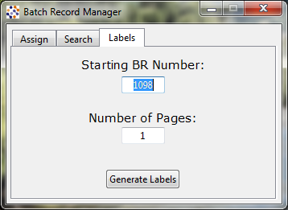

<a href="index">

</a>

## Batch Record Manager

##### for Windows
---
### Background:
When the corporate heads at my company decided to change the software that was used in our lab, the Quality Assurance department was left with the task of receiving and organizing new records that didn't contain any easily-fileable information included in the record packets. My task was to devise a way to easily and accurately add these records to a database, assign them a new internal number, and make it easy for the computer-illiterate chemists at the laboratory to look up old records by the new software's automatically-assigned reference values. The laboratory kept most of its logs in Excel sheets, so in order to keep the learning curve to a minimum, it was decided that an Excel sheet would be the database of choice. Python3 and [openpyxl](https://openpyxl.readthedocs.io/en/stable/) were used behind Tkinter to create a GUI to manage these records within the QA department.

#### Assign Tab:
Management and ISO regulations required that the QA department enter and verify each record into the database. This, and the problems that come with having multiple people using the same spreadsheet at the same time, means that enabling each analyst to assign a batch record number individually was not an option. 

The new lab software assigned a number to each batch in the following format: ASSAY_TYPE-DATE-NUMBER. The solution for QA to manage these non-sequential records was to assign each record a new "BR number." In order to efficiently and accurately log these, a user interface was developed which allowed one to quickly choose an assay type, date, and number from drop-down menus, and save it to the Excel log with as few clicks as possible.


#### Search Tab:
The search tab provided a quick way to search by either BR number or Batch Record ID. This was used to reference the folder's position in the filing area, so it could be quickly found. The program contained a local python dictionary of all of the records within the log. When typing into the search box, the program live-filters results that match the query, and populates the results box.


#### Labels Tab:
The labels tab allows the user to generate sequential BR number labels to affix to the folder after the number is assigned to it. The program uses [python-docx](https://python-docx.readthedocs.io/en/latest/) to create a word doc formatted to Avery 8167 labels. If python-docx is not installed, the UI directs the user on how to install the PyPi module.



---

### Code:

[Here](https://github.com/jsmillie7/python_examples/tree/master/BRM) is the .pyw file on GitHub.

#### Libraries and Variables
```python
#!/usr/bin/env python
# coding: utf-8

### Modules and Libraries
try:
    from tkinter import *
    from tkinter import ttk, messagebox
    import openpyxl, datetime, os
    from openpyxl.styles import Alignment
    from pynput.keyboard import Key, Controller as KC
    from dateutil.relativedelta import relativedelta
    from Prefix import *
    import BR_Label_Maker as lm
except Exception as e:
    root2 = Tk()
    if messagebox.showerror("Error", 'The following error occurred:\n{}\nPlease make sure all necessary python modules are installed.'.format(e)) == 'ok':
        root2.destroy()
        exit()
    root2.mainloop()

### Global Variables
# Instance of pynput keyboard
k = KC() 

# Excel database
file = 'Batch Report Log.xlsx' 

# UI Color
color = 'azure3'
```
#### Global Classes
```python
class nextBR:
    ### finds the next available BR# from the file.

    def __init__(self):
        self.BRVar = StringVar()
        self()
            
    def __call__(self):
        self.load()
        self.get_next_cell()
        self.BR = self.sheet.cell(row=self.next, column=1).value
        self.BRVar.set(self.BR)
    
    def get_next_cell(self):
        for num,cell in enumerate(self.sheet['B']):
            if cell.value is None:
                self.next = num + 1
                break
                
    def load(self):
        if os.path.exists(file):
            self.wb = openpyxl.load_workbook(filename = file)
            self.sheet = self.wb.active

        else:
            messagebox.showerror("Error", 'Batch Record Log not found!\nFilepath: {}'.format(file))
            root.destroy()
            exit()


class Framework:
    ### The backbone of the UI. Creates and lays out each class object in the correct spot
    ### and on the correct tab. Makes the layout modular and easily changable.
    
    def __init__(self, parent):
        self.parent = parent
        self.tabs = ttk.Notebook(self.parent)
        self.tab1 = ttk.Frame(self.tabs)
        self.tab2 = ttk.Frame(self.tabs)
        self.tab3 = ttk.Frame(self.tabs)
        self.tabs.add(self.tab1, text='  Assign  ')
        self.tabs.add(self.tab2, text='  Search  ')
        self.tabs.add(self.tab3, text='  Labels  ')
        self.tabs.pack(expand=1, fill='both', padx=5, pady=5)
        
        # Modules
        self.nextBR = nextBR_GUI(self.tab1)
        ttk.Separator(self.tab1, orient="horizontal").pack(fill=X,expand=1, pady=(0,5))
        self.dd = dropdowns(self.tab1)
        self.entry = batchID(self.tab1, self.dd)
        self.buttons = Buttons(self.tab1, self.entry)
        self.entry.input.trace('w', self.tracer)
        self.entry.input.set('')
        
        self.search = search_framework(self.tab2)
        
        self.labels = label_frame(self.tab3)
        self.nextBR.next.BRVar.trace('w', self)
        
    def tracer(self, *args):
        text = self.entry.input.get().replace(' ','')
        if len(text) > 0:
            self.buttons.b3.config(state=NORMAL)
        else:
            self.buttons.b3.config(state=DISABLED)
    
    def __call__(self, *args):
        self.search()
        self.labels()
```
#### Assign tab
```python             
class nextBR_GUI:
    ### Displays the Next Available BR# in Assign tab
    
    def __init__(self, parent):
        self.parent = parent
        self.f = Frame(self.parent, bd=1, relief=FLAT, bg=color)
        self.f.pack(fill=BOTH, expand=1)
        self.label= Label(self.f, font="Verdana 11", bg=color)
        self.label.pack(padx=10, pady=10)
        self.next = nextBR()
        self()
        
    def __call__(self):
        self.next()
        self.label.config(text='Next Available BR#: {}'.format(self.next.BR))


class dropdowns:
    ### Creates the dropdown menus in Assign tab

    def __init__(self, parent):
        self.parent = parent
        self.wid = 8
        
        self.f = Frame(self.parent)
        self.f.pack(fill=None, expand=1)
        
        self.typeVar = StringVar(self.parent)
        self.dateVar = StringVar(self.parent)
        self.numVar = StringVar(self.parent)
        
        self.type = ttk.OptionMenu(self.f, self.typeVar, *prefix)
        self.type.pack(side=LEFT, fill=X, expand=1, padx=(65,0))
        self.type.config(width=self.wid)
        
        self.dates = [self.gd(x) for x in range(1,-8,-1)]
        self.date = ttk.OptionMenu(self.f, self.dateVar, *self.dates)
        self.date.pack(side=LEFT, fill=X, expand=1)
        self.date.config(width=self.wid)
        
        self.nums = [i for i in range(0,7)]
        self.num = ttk.OptionMenu(self.f, self.numVar, *self.nums)
        self.num.pack(side=LEFT, fill=X, expand=1)
        self.num.config(width=self.wid//2)
        
        self.reset()
        
        self.rst = Button(self.f, text='Q', command=self.reset, font=('Wingdings 3', 10))
        self.rst.pack(side=LEFT, padx=(0,13), pady=(0,0))
        
        self.rst.bind("<Enter>", self.hover)
        self.rst.bind("<Leave>", self.unhover)
        
    def gd(self,delta):
        t = datetime.date.today()
        d = t + relativedelta(days=delta)
        return '{}{:02d}{:02d}'.format(str(d.year)[2:4],d.month,d.day)
    
    def reset(self):
        self.typeVar.set('Assay')
        self.dateVar.set('Date')
        self.numVar.set('#')
        
    def hover(self, *args):
        self.text =  framework.buttons.label.cget("text")
        framework.buttons.label.config(text='Reset Inputs')
        
    def unhover(self, *args):
        framework.buttons.label.config(text=self.text)


class batchID:
    ### The input field in Assign tab that will be saved into the log

    def __init__(self, parent, dd):
        self.parent = parent
        self.dd = dd # dropdown menus
        
        self.input = StringVar(self.parent)
        
        self.f = Frame(self.parent)
        self.f.pack(fill=BOTH, expand=1, padx=(10,5))
        
        Label(self.f, text='Batch ID:').pack(side=LEFT)
        
        self.e = Entry(self.f, textvariable=self.input)
        self.e.pack(side=LEFT,fill=X, expand=1, pady=10, padx=(5,10))
        
        self.dd.typeVar.trace("w", self.update_entry)
        self.dd.dateVar.trace("w", self.update_entry)
        self.dd.numVar.trace("w", self.update_entry)
        
        self.e.focus()
        
    def update_entry(self, *args):
        a,b,c = ('','','')
        if self.dd.typeVar.get() != 'Assay':
            a = prefix[self.dd.typeVar.get()]
        if self.dd.dateVar.get() != 'Date':
            b = self.dd.dateVar.get()
        if self.dd.numVar.get() != '#':
            c = '-' + self.dd.numVar.get()
        self.input.set('{}{}{}'.format(a,b,c))
        self.e.focus()
        k.press(Key.end) # move cursor to end of updated entry
        k.release(Key.end)


class Buttons:
    ### The buttons on Assign tab that perform the actions

    def __init__(self, parent, entry):
        self.parent = parent
        self.entry = entry # entry class
        
        self.f = Frame(self.parent)
        self.f.pack(fill=X, expand=1)
        self.f2 = Frame(self.parent, bd=1, relief=SUNKEN)
        self.f2.pack(fill=X, expand=1, padx=3, pady=(0,2))
        
        self.b1 = ttk.Button(self.f, text='Close', command=root.destroy)
        self.b1.pack(side=LEFT, expand=1, fill=X, padx=(45,5), pady=(0,5))
        self.b2 = ttk.Button(self.f, text='Open Log', command=lambda: os.startfile(file))
        self.b2.pack(side=LEFT, expand=1, fill=X, pady=(0,5))
        self.b3 = ttk.Button(self.f, text='Assign BR#', command=self.add_to_log)
        self.b3.pack(side=LEFT, expand=1, fill=X, padx=(5,45), pady=(0,5))
        self.text = 'Enter Batch ID'
        self.label = Label(self.f2, text = self.text)
        self.label.pack()
        
        self.b1.bind("<Enter>", lambda *args:self.hover(0))
        self.b1.bind("<Leave>", self.unhover)
        self.b2.bind("<Enter>", lambda *args:self.hover(1))
        self.b2.bind("<Leave>", self.unhover)
        self.b3.bind("<Enter>", lambda *args:self.hover(2))
        self.b3.bind("<Leave>", self.unhover)
        self.f2.bind("<Enter>", lambda *args:self.hover(4))
        self.f2.bind("<Leave>", self.unhover)
        
        
    def add_to_log(self, *args):
        self.b3.unbind("<Leave>")
        BR_num = framework.nextBR.next.BR
        batch_id = framework.entry.input.get()
        row = framework.nextBR.next.next
        framework.nextBR.next.sheet.cell(row=row, column=2).value = batch_id
        framework.nextBR.next.sheet.cell(row=row, column=2).alignment = Alignment(horizontal="center", vertical="center")
        try:
            framework.nextBR.next.wb.save(filename = file)
            framework.nextBR()
            framework.dd.reset()
            self.label.config(text='Saved: {} - {}'.format(BR_num,batch_id))
        except:
            self.label.config(text='An Error Occurred. Check BR Log!')
        framework.entry.e.focus()
        
    def hover(self, num, *args):
        ### The status bar below the buttons is dynamic, and gives details about actions by hovering over them
        ### This defines the messages that can be shown
        
        if num == 2:
            self.b3.bind("<Leave>", self.unhover)
        self.text =  self.label.cget("text")
        phrases = [
            'Close Batch Record Manager',
            'Open Batch Record Log (xlsx)',
            'Add Item to Batch Record Log',
            'Batch ID cannot be blank',
            self.text + ' (Undo)',
        ]
        
        if num == 4 and 'Saved' in self.text:
            self.label.config(text=phrases[num], cursor="hand2")
            self.label.bind("<Button-1>",self.undo)
        elif num == 2:
            if str(framework.buttons.b3['state']) == 'normal':
                self.label.config(text=phrases[num])
            elif str(framework.buttons.b3['state']) == 'disabled':
                self.label.config(text=phrases[num+1])
        elif num in (0,1):
            self.label.config(text=phrases[num])
        
    def unhover(self, *args):
        self.label.unbind("<Button-1>")
        self.label.config(text=self.text, cursor="")
        
    def undo(self, *args):
        framework.nextBR.next.sheet.cell(row=framework.nextBR.next.next-1, column=2).value = None
        try:
            framework.nextBR.next.wb.save(filename = file)
            framework.nextBR()
            framework.dd.reset()
            self.text = 'Undone'
        except:
            self.label.config(text='An Error Occurred. Check BR Log!')
        framework.entry.e.focus()
```
#### Search tab
```python
class search_framework:
    ### This is the framework behind the Search tab that builds each individual module onto the tab
    
    def __init__(self, parent):
        self.parent = parent
        self.SB = searchbar(self.parent)
        self.RE = results(self.parent)
        self.SB.query.trace('w',self.RE.fill)
        
    def __call__(self):
        self.RE.fill()
        

class searchbar:
    ### Input field in Search tab
    
    def __init__(self, parent):
        self.parent = parent
        self.f1 = Frame(self.parent)
        self.f1.pack(expand=1, fill=X)
        self.query = StringVar()
        self.e = Entry(self.f1, textvariable=self.query)
        self.e.pack(side=LEFT, fill=X, expand=1, padx=(40,2), pady=(5,0))
        self.reset()
        self.b1 = ttk.Button(self.f1, text='Reset', command=self.reset)
        self.b1.pack(side=LEFT, padx = (2,40), pady=(5,0))
        
    def reset(self):
        self.query.set('')
        self.e.focus()


class results:
    ### The box which shows the search results in Search tab
    
    def __init__(self, parent):
        self.parent = parent
        self.f1 = Frame(self.parent, height=10)
        self.f1.pack(fill=BOTH, expand=1)
        self.tree = ttk.Treeview(self.f1,height=6)
        self.tree['show'] = 'headings'
        self.tree['columns'] = ('BR', 'Batch Record')
        self.tree.heading('BR', text='BR Number')
        self.tree.heading('Batch Record', text='Batch Record', anchor='w')
        self.tree.column('BR', width=60, anchor='center')
        self.tree.column('Batch Record', anchor='w')
        self.ysb = ttk.Scrollbar(self.f1, orient=VERTICAL, command=self.tree.yview)
        self.tree['yscroll'] = self.ysb.set
        self.tree.pack(side=LEFT, expand=1, fill=BOTH, padx=(5,0), pady=(5,5))
        self.ysb.pack(side=LEFT, fill=Y, pady=(5,5), padx=(0,0))       
        self.tree.tag_configure('focus', background='azure3')
        self.tree.bind("<Motion>", self.mycallback)
        self.last_focus = None
 
    def mycallback(self, event):
        _iid = self.tree.identify_row(event.y)
        if _iid != self.last_focus:
            if self.last_focus:
                try: 
                    _oldtag = self.tree.item(self.last_focus)['tags']
                    if isinstance(_oldtag, list):
                        _oldtag.remove('focus')
                    self.tree.item(self.last_focus, tags=_oldtag)
                except: self.last_focus = None
            
            _tags = self.tree.item(_iid)['tags']
            if isinstance(_tags, list):
                _tags.append('focus')
            self.tree.item(_iid, tags = _tags)
            self.last_focus = _iid
        
    def fill(self, *args):
        self.get_data()
        for i in self.tree.get_children():
            self.tree.delete(i)

        self.query = framework.search.SB.query.get()
        self.results = [x for x in self.data if self.query.upper() in x[0].upper() or self.query.upper() in x[1].upper()]
        
        for num,i in enumerate(self.results):
            if num%2 != 0:
                self.tree.insert('', 'end', values=(i[0],i[1]), tags = ['oddrow'])
            else:
                self.tree.insert('', 'end', values=(i[0],i[1]), tags = ['evenrow'])
        self.tree.tag_configure('oddrow', background='azure2')
        
    def get_data(self):
        sheet = framework.nextBR.next.sheet
        self.data = [(sheet.cell(row=num+1, column=1).value, sheet.cell(row=num+1, column=2).value)
                     for num,cell in enumerate(sheet['A']) if sheet.cell(row=num+1, column=2).value is not None]
        self.data.pop(0)
```
#### Label tab
```python
class label_frame:
    ### Creates the Label tab, which is simple enough to fit in one class.
    
    def __init__(self, parent):
        self.parent = parent
        self.numVar = IntVar()
        self.pageVar = IntVar()
        self.pageVar.set(1)
        
        try:
            import BR_Label_Maker as lm
        except:
            Label(self.parent, text='Please install module python-docx',font="Verdana 11").pack(expand=1)
            return
        
        Label(self.parent, text='Starting BR Number:',font="Verdana 11").pack(expand=0, pady=(10,3))
        self.entry = ttk.Entry(self.parent, textvariable=self.numVar, width=8, justify='center')
        self.entry.pack(fill=None, expand=0)
        Label(self.parent, text='\nNumber of Pages:',font="Verdana 11").pack(expand=0)
        self.pages = ttk.Entry(self.parent, textvariable=self.pageVar, width=8, justify='center')
        self.pages.pack(fill=None, expand=0)
        ttk.Button(self.parent, text='Generate Labels', command=self.make).pack(side=BOTTOM, pady=(0,10))
    
    def __call__(self, *args):
        self.numVar.set(int(framework.nextBR.next.BR.replace('BR','')))
        
    def make(self, *args):
        try:
            lm.Maker(lm.file,self.numVar.get(),self.pageVar.get())
        except:
            messagebox.showerror("Error", "File cannot be created. Make sure it is closed and try again.")
```
#### Main Code
```python
root =Tk()
root.resizable(False, False)
root.iconbitmap('dot.ico')
root.title('Batch Record Manager')
framework = Framework(root)
framework()
root.geometry("+{}+{}".format((root.winfo_screenwidth() - 350)//2, 
                              (root.winfo_screenheight() - 300)//2))
mainloop()
```


### DELETE THIS

<blockquote class="imgur-embed-pub" lang="en" data-id="a/fdHZ2vQ">
    
    <a href="//imgur.com/a/fdHZ2vQ">
    
    ATTiny84/85 programmer board
    
    </a>
    
    </blockquote>
    
    <script async src="//s.imgur.com/min/embed.js" charset="utf-8">
    
    </script>
