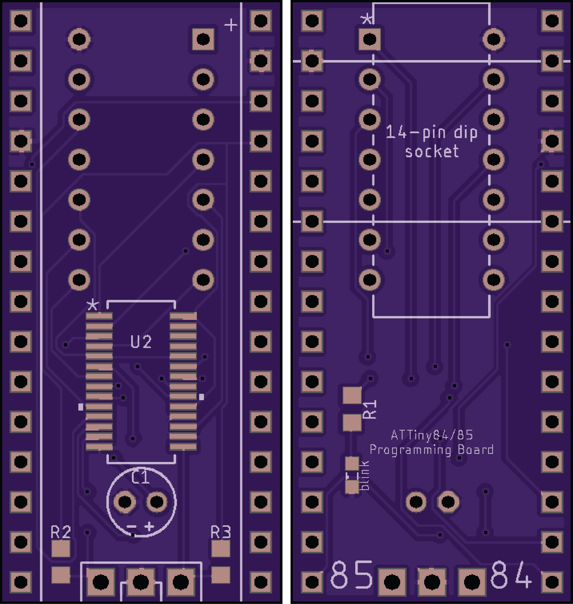

# ATTiny84/85 Programmer

##### Arduino

---

<figure align="center">
  
  <figcaption>ATTiny84/85 Programmer Board renders from OSH Park</figcaption>
</figure>

## Background:

ATTiny84 and ATTiny85 microcontrollers paired with arduino make for extremely useful little chips in projects that require few I/O pins and low power. They are cheap and easy to program, so long as you have the patience to connect several jumper wires between specific pins on both the Arduino programmer and the ATTiny chip. 

<figure align="center">
  
  <figcaption>ATTiny85 Programming Circuit (<a href="https://create.arduino.cc/projecthub/arjun/programming-attiny85-with-arduino-uno-afb829">Source</a>)</figcaption>
</figure> 

Both the ATTiny84, which has 14 pins, and the ATTiny85 with 8 pins, have different wiring diagrams so there is no way to easily program them one after another. As seen in the diagram above, the wiring can get messy. I found myself programming many of these microcontrollers for various projects and tests and got sick of rewiring everytime I changed something. The inspiration for an ATTiny programming PCB was born. 

## Circuit Design

Online, there are various programmers available for ATTiny85, fewer for the larger 84 board, and none that worked for both. I like to use both, and didn't want to have multiple programmers. Also, on OSH Park, you pay by the square inch, so keeping the footprint small was a priority. The overall footprint matches the Arduino Nano. A 14-pin DIP connector was added, since both the 14 pin and 8 pin variants could fit in it. I then added a 16:8 MUX/DEMUX that allowed me to switch the arduino inputs, powers and grounds to the correct pins, depending on which chip is selected, by grounding either 84 or 85. A pull-up resistor on each pin keeps the unselected pin high, and the multiplexor off for that input. An LED was added to allow for a blink program to verify programming.

#### Schematic:

The circuit was designed in AutoDesk Eagle and sent to OSH Park for fabrication.
<figure align="center">
  
</figure>

#### PCB:

The final product turned out great. It worked perfectly and has made my life programming ATTinys much simpler. I did a bad job of cleaning off the extra flux, so the board has a bit of a crust on it, but I have since learned my lesson. My soldering skills have also improved significantly since this was done.

  
  

  
  
Top of Programmer without ATTiny chip installed.

  

  
  

  
  
ATTiny84/85 programmer board with Arduino Nano installed.

  

  
  

  
  
Top of Programmer Board, showing ATTiny84 in socket, jumper shunt in incorrect position (should be moved to ATTiny84), and test LED circuit.

  

  
  

  
  
Underside of programmer board showing MUX, electrolytic capacitor and Arduino Nano headers, without Arduino installed.

  

  
  

  
  
Programmer Board with ATTiny84 (programmer in ATTiny85 mode, should be switched to 84 mode)

  

  
  

  
  
Arduino Nano Microcontroller

  

#### Bill of Materials:

Code|Item|Qty
:-:|:-:|:-:
U2|PI5C3390QEX 16:8 MUX/DEMUX|1
-|30-Pin Female Header, 0.1"|2
-|3-Pin Male Header, 0.1"|1
-|Shunt Jumper|1
R2,R3|10K Resistor, 0603|2
R1|47 Ohm Resistom, 0603|1
D1|Green LED, 0603|1
C1|10nF Electrolytic Capacitor|1
-|Arduino Nano|1
U1|14-Pin DIP Socket|1

