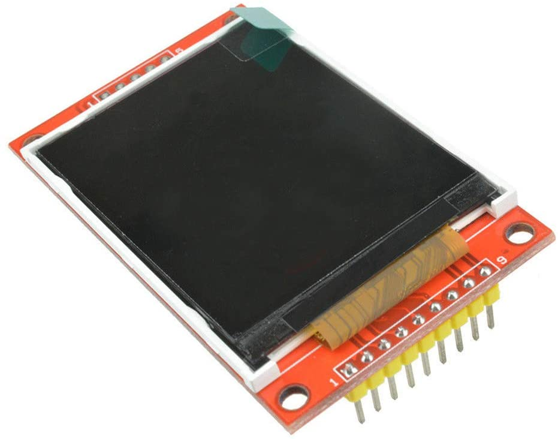
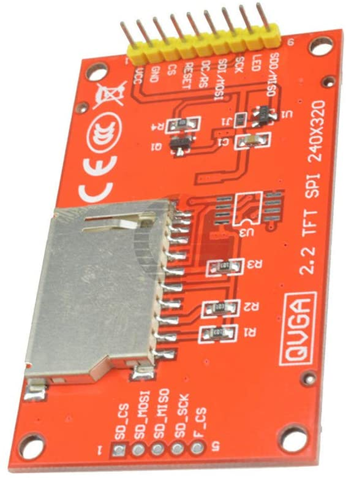
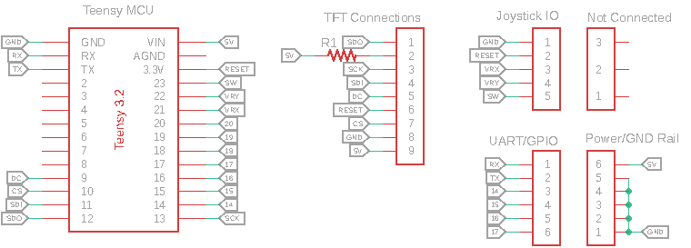
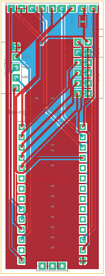
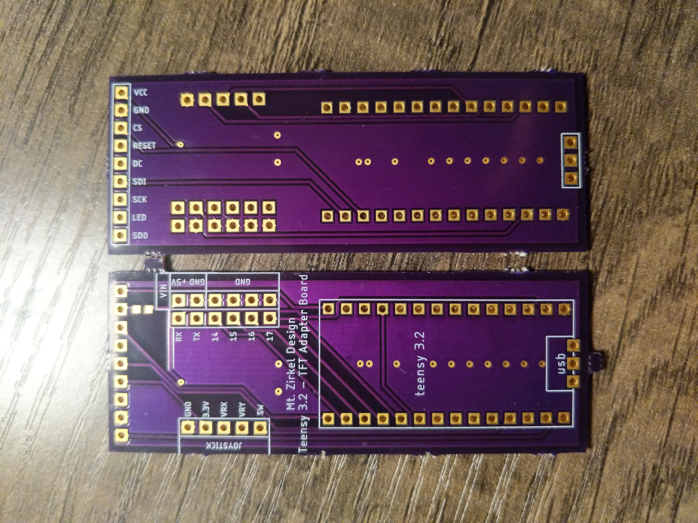
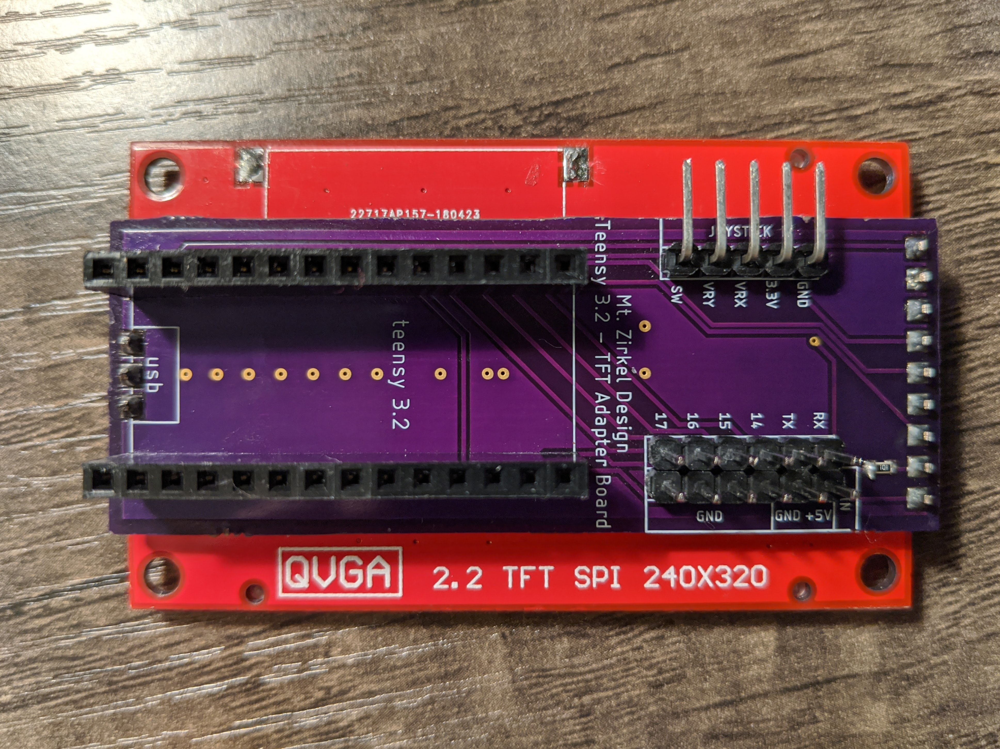
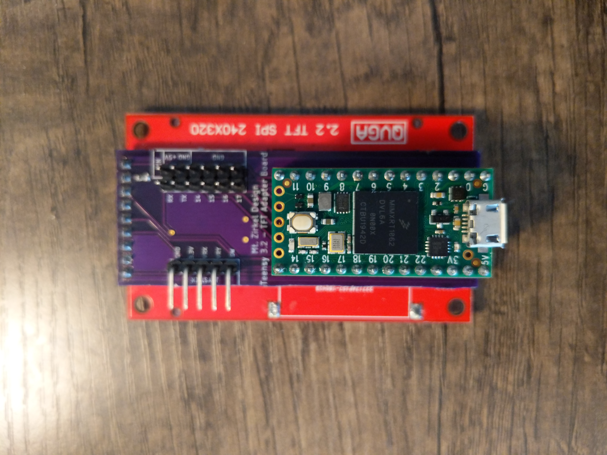

## TFT Shield PCB

##### for Teensy 3.2/4.0
---
#### Background:
I ordered [this](https://www.amazon.com/gp/product/B01CZL6QIQ) TFT screen. I was interested in learning how to use this technology in projects, when I quickly learned how frustrating working with a screen like this could be. The screen module is not a touch screen, but requires __9__ wires to display correctly. The module is also very sensitive to voltages, and plugging the wrong wire into the wrong spot can destroy the screen. This exact scenario happened to the first one that I bought. I needed a cleaner, more consistent way to interface with the board.

    
    

#### Choosing an MCU:
The screen uses Serial Peripheral Interface (SPI) to communicate with a Microcontroller (MCU) to change what is displayed. Originally, I used an Arduino Nano that I had sitting around, but the refresh rate of the screen was abysmal, taking several seconds to display lines of text. I needed something faster! Enter the Teensy 3.2. The tiny board has all the I/O I could ask for, and overclocked, ran at 96MHz, which is 6x faster than the Nano, and one of the fastest boards available at the time.

#### Designing a PCB:
With the MCU chosen, I needed a way to get rid of the 9 jumper wires needed to connect the two. Using Autodesk Eagle, I created all of the parts needed, and drew out a schematic of my idea. Beyond just connections to the screen, I wanted to add some input/output options to interact with the screen. I had an analog joystick that I wanted to use to potentially allow selection through menus, so I created a joystick port for the 5 wires required for that, as well as a port the included access to the UART RX/TX pins, 4 additional GPIO pins with grounds for each, and a 5V-in port to supply power without the USB. 

    

The screen's SPI pins were moved to one end of the board, and the screen conveniently has 5 pins on the opposite end of the board for use with the onboard SD card (which I desoldered and removed, since it was in the way and doesn't work with Teensy, anyways). I laid out the board in Eagle, uploaded the final design to [OSH Park](https://oshpark.com/shared_projects/d99zqTvy) and ordered a set of boards. The required components for the board  are:
* 1x 2.2" TFT screen
* 1x 100ohm resistor (0603)
* 2x 14 pin female headers
* 1x Teensy 3.2 or 4.0

     
    Eagle board Layout 
    

#### The Resulting Board

Here is the set of boards that I received from OSH Park:

    

#### After soldering all of the pins in place and tesing to make sure it worked, here is what the board looked like:

    
    
    

### And here is a GIF of it in action!

  

