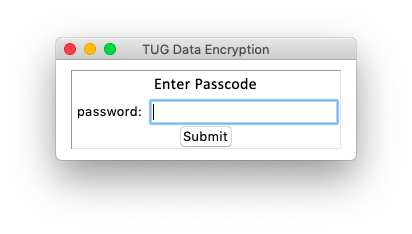

## Data Encrytpion UI for Cloud Storage
---
### Background:
This project was developed for a start-up to encrypt sensitive proprietary files to be shared over the cloud, via email, or anywhere. This app was developed using [this](https://pypi.org/project/cryptography/) PyPi cryptography package in the backend and Tkinter for the front end. The UI is very minimalist, consisting of just 2 screens: 
#### a log-in screen 
that doesn't allow any file encryption/decryption until correct password is entered


#### and the encrypt/decrypt screen
which opens a file browser and sends the chosen file through the selected process.


### Code:

```python
import base64, tkinter
from tkinter import *
from tkinter.filedialog import askopenfilename
from cryptography.fernet import Fernet
from cryptography.hazmat.backends import default_backend
from cryptography.hazmat.primitives import hashes
from cryptography.hazmat.primitives.kdf.pbkdf2 import PBKDF2HMAC


def pw_key_gen(pw):
    pw = pw.encode()
    kdf = PBKDF2HMAC(
        algorithm = hashes.SHA256(),
        length = 32,
        salt = b'xxx', # randomly generated hash using os.urandom(16)
        iterations = 100000,
        backend = default_backend()
    )
    key = base64.urlsafe_b64encode(kdf.derive(pw))
    return key


class password:
    def __init__(self, parent):
        # variables
        self.p1 = StringVar()
        self.parent = parent
        self.crypto = b'xxx' # encryption key to verify password against
        
        # window setup
        self.t = Frame(self.parent, bd=1, relief=SUNKEN)
        self.t.pack(expand=1)
        
        Label(self.t,text='Enter Passcode', font=('Calibri','16')).grid(columnspan=2,row=0,column=0)
        Label(self.t,text='password:').grid(row=1,column=0, sticky=E)
        self.l1 = Entry(self.t, textvariable=self.p1, show="*")
        self.l1.grid(row=1,column=1)
        Button(self.t,text='Submit',command=self.submit).grid(columnspan=2,row=3,column=0)#, sticky=EW)
        
        
    def submit(self):
        pw_try = pw_key_gen(self.p1.get())
        if pw_try == self.crypto:
            self.key = pw_try
            self.t.pack_forget()
            self.files(self.parent,self.key)
        else:
            self.error = Label(self.t, text='incorrect password')
            self.error.grid(columnspan=2,row=4,column=0, sticky=EW)
            self.p1.set('')
    
    class files:
        def __init__(self, parent, key):
            self.parent = parent
            self.key = key
            self.win = Frame(self.parent)
            self.win.pack(fill=BOTH, expand=1)
            
            self.encrypt = Button(self.win, text='Encrypt File', command=self.file_encrypter)
            self.encrypt.pack(side=RIGHT, fill=BOTH, expand=1)
            
            self.decrypt = Button(self.win, text='Decrypt File', command=self.file_decrypter)
            self.decrypt.pack(side=LEFT, fill=BOTH, expand=1)
            
        def file_encrypter(self):
            fname = askopenfilename()
            if fname != '':
                self.save(fname, fname + '.TUG')

        def file_decrypter(self):
            fname = askopenfilename()
            if fname != '':
                self.load(fname, fname[:-4])
                
                
        def load(self,file_in, file_out):
            in_file = open(file_in, "rb")
            x = in_file.read()
            in_file.close()

            f2 = Fernet(self.key)
            decrypted = f2.decrypt(x)

            op = open(file_out, "wb")
            op.write(bytearray(decrypted))
            op.close()
            
            
        def save(self, file_in, file_out):
            in_file = open(file_in, "rb")
            data = in_file.read()
            in_file.close()

            f1 = Fernet(self.key)
            encrypted = f1.encrypt(data).decode()

            op = open(file_out, "wb")
            op.write(encrypted.encode())
            op.close()
             
             
root = Tk()
root.geometry('300x100')
pw = password(root)
mainloop()
```
