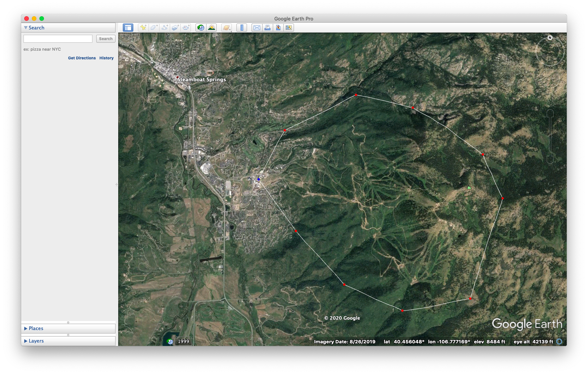
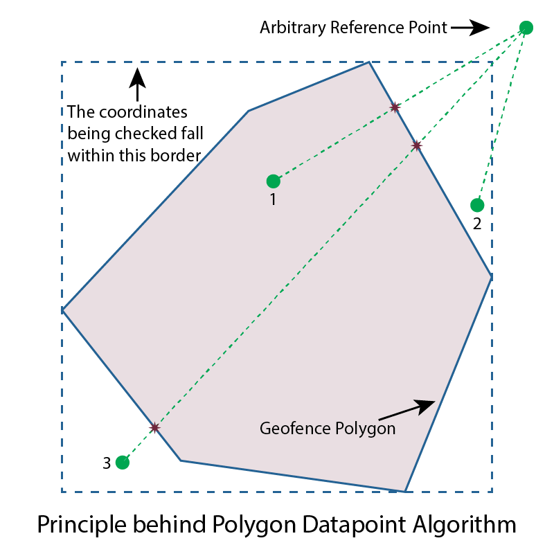
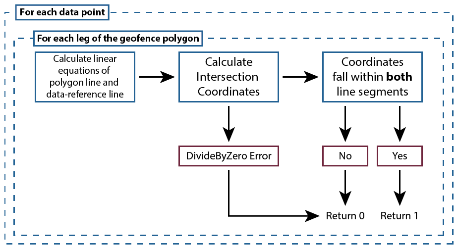
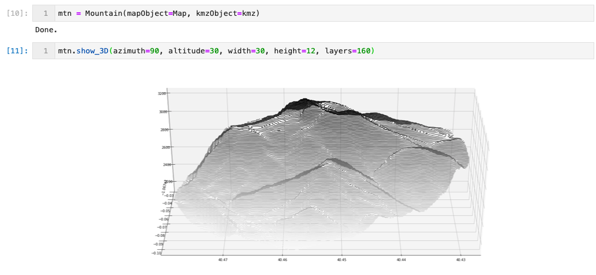
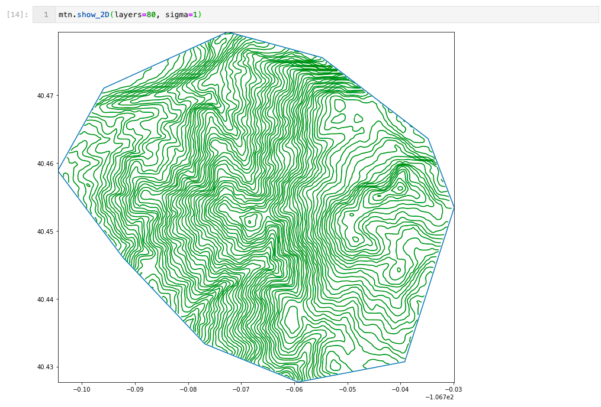

<a href="/index">

</a>

## Modeling the Earth

##### Jupyter Notebook
---
### Contents:
1. [Background](#Background)
2. [Resource Acquisition](#Resource-Acquisition)
3. [Data Processing](#Data-Processing)
4. [Making the data usable](#Making-the-data-usable)
---
### Background:

<p align="center">
  
</p>


Growing up in Colorado, the mountains are a way of life. I spent many of my formative years in and around Steamboat Springs, which is home to world-class skiing at Steamboat Resort. As an adult, the mountains are just a daydream on the horizon most days. I have always been fascinated by cartography and topography, but I had never applied what I knew about maps to any situation outside of real-world navigation. I wanted to find a way to combine my computer science and mathematics experience with real-world data, and thus, an idea was born: I wanted to make a physical representation of one of my favorite places on Earth utilizing just the resources I had at hand: an internet connection, python and a [CNC laser cutter](/laser). 

[\[top\]](#Modeling-the-Earth)

---

### Resource Acquisition:

#### Outlining the Area

The first step was to get a polygon of the coordinates of the desired area. The easiest way to do this was to use Google Earth Pro to draw a path and export it as a .KMZ file. The resulting path for Mt. Werner can be seen below.

<p align="center">
  
</p>


#### Acquiring the Elevation Data

The US Geological Survey is an excellent resource for free Earth-relevant data. Using [EarthExplorer](https://earthexplorer.usgs.gov), I navigated to Mt. Werner data sets, chose the Digital Elevation branch, chose SRTM 1 Arc-Second Global data, and downloaded the result as a [GeoTIFF file](files/n40_w107_1arc_v3.tif).

<p align="center">
  
</p>

[\[top\]](#Modeling-the-Earth)

---

### Data Processing:

#### A quick note on data structure

The for data that is created and referenced often, a consistent data structure makes life much easier. I like using [__collections.namedtuple__](https://docs.python.org/3/library/collections.html) instances anytime that I am creating a data structure. In this project, two types of namedtuples were created:
1. A coordinate tuple to easily access latitude/longitude values:
```python
coord = namedtuple('coord','lat lon')
```
2. A linear equation tuple to quickly contain calculated slope (m) and offset(b) data:
```python
linEQ = namedtuple('linEQ','m b')
```

You will see both of these data structures referenced throughout the code.

#### Parsing the KMZ file
###### Class: KMZ

A KMZ file is a special zipped XML file that contains all of the data surrounding the path, and most importantly for this project, a list of coordinates for each corner of the outlined polygon. [This](http://programmingadvent.blogspot.com/2013/06/kmzkml-file-parsing-with-python.html) source was a big help in figuring out how to get the coordinate data out of the KMZ file. I used the PlacemarkHandler class from this source verbatin, since the tedious work was already done. I created another class called KMZ to wrap all of the actions surrounding the KMZ data into one easy to use package. After the KMZ file is read, it will build the geofence polygon:

```python        
def get_coords(self):
    ### This function builds the geofence polygon from the KMZ file data
    self.fence = [coord(lat=float(coordinate.split(',')[1]), lon=float(coordinate.split(',')[0])) \
                  for coordinate in self.handler.mapping[list(self.handler.mapping)[0]] \
                  ['coordinates'].split()]

    ### Prevent the closed loop divide by zero error
    if self.fence[0] == self.fence[-1]:
        del self.fence[-1]
```

Another function in this class will generate the filename of the elevation GeoTIFF file using the standard naming practices that the USGS utilizes. It will check the directory to see if the file has been downloaded from the USGS EarthExplorer site already, and will return an error if the file is not present. Downloading the file will fix this.
```python
def get_filename(self):
    ### This function will find the name of the GeoTIFF file that contains the required data
    ### using the file naming convention that the USGS defaults to
    ### i.e. 'n40_w107_1arc_v3.tif'
    ### This only works in Northern and Western hemispheres

    fname = f'n{math.floor(self.fence[0].lat)}_w{abs(math.floor(self.fence[0].lon))}_1arc_v3.tif'
    if path.exists(fname):
        return fname
    else:
        print(f'File not found. Download {fname} from USGS EarthExplorer!')
        return None
```

Finally, a quick plot can be created to visualize the geofence, which looks like the this in a Jupyter notebook:

<p align="center">
  
</p>

For the full class, please see the Jupyter file.

#### Create an object to handle GeoTIFF data
###### Class: MapObject

Now that the .kmz file has been dealt with, we can dynamically load the correct map data based on the KMZ model by calling the KMZ.filename variable. A new class called "MapObject" was created to deal with the GeoTIFF file. Contained within the metadata of the GeoTIFF, we can find information about the data enclosed in the file encoded by various codes: 

Code | Attribute | Value
:-:|:-:|:-:
256|Pixels in X Direction|3601
257|Pixels in Y Direction|3601
33922|NW Corner Coordinates| Lat: 41°, Lon: -107°
33550|Degrees per Pixel| X: 0.000278, Y: 0.000278

A lot more data is encoded in the metadata of these files, but this is enough for now. From this metadata we can conclude the following:

- The GeoTIFF file is a 3601x3601 matrix of elevation data over 1 degree<sup>2</sup> of area on Earth. 
- The North-West coordinate is is at 41° North, -107° West. 
- Each index within the matrix corresponds to a location 0.000278 degrees away from the indecies next to it. 
- The value of the matrix at each location is the elevation there, in meters.

Finding a coordinate in the matrix is as simple as calculating the degrees per pixel times the change in degrees from the NW corner:

```python
def delta(self, coords):
    ### the argument 'coords' must be a namedtuple instance of coord

    ### make sure the coordinate is the right type:
    if type(coords) is not type(self.test):
        raise Exception('coords is of the wrong type! must be coord namedtuple.')

    ### calculate the index of the matrix for the desired location
    n_lat = int(abs((coords.lat-self.NW.lat)/self.dlat))
    n_lon = int(abs((coords.lon-self.NW.lon)/self.dlon))
    return (n_lat, n_lon)
```

This function returns the matrix indicies that correspond to a specific coordinate. To get the elevation at that coordinate, another function was added to the class:

```python
def elevation(self,coords):
    ### the argument 'coords' must be a namedtuple instance of coord

    ### get the indicies of the array that correspond to the lat/lon of coordinates
    n_lat, n_lon = self.delta(coords)

    ### Check to make sure that n_lat and n_lon are within the range of the array
    if n_lat not in range(self.size[0]) or n_lon not in range(self.size[1]):
        raise Exception(f'{n_lat} or {n_lon} Not in Range!!')

    return self.array[n_lat][n_lon]
```

Now we have access to all of the data in the GeoTiff file. The entire class can be seen in the Jupyter file. The next step is to build a method to build an elevaton profile for the data contained within the polygon in the KMZ file. 

#### A Mountain sized task

Creating an elevation profile inside of a polygon, while excluding all data outside of it was one of the trickier parts of this entire project. How can you tell what is inside an arbitrary polygon, and what isn't, based on its coordinates? I had to develop an algorithm to check each matrix element and see if it was inside or outside of the polygon. First, only data that fell between the maximum and minimum coordinates was considered. The principle behind the method turned out to be fairly elementary: how many lines of the polygon does the point cross if you draw a line from it to an arbitrary reference point outside of the data set?

<p align="center">
  
</p>

As you can see, points outside of the polygon will cross an __even__ number of lines (including 0), and points inside of the polygon will cross an __odd__ number of times. Visualizing this is easy, but how do you calculate it? Since both the leg of the polygon and the data-to-reference-point are line segments, basic linear equations in the form of Y = mx+b can be calculated for them. Now that we have the equations (the slope _m_ and offset _b_) for both line segments, we can calculate how many times they intersect by the following logic:

<p align="center">
  
</p>


By summing the values returned for all segments in the polygon, we can tell if a point is inside or outside of the polygon. If it is inside the polygon, we add its elevation to the matrix, otherwise, we leave it as None to ignore the point. 

__The linear equation parameters are calculated using self.get_linear_equation__

```python
def get_linear_equation(self, pt1, pt2):
    ### Calculate the slope and offset of linear equation that 
    ### connects two points of the form y = mx + b

    ### Slope (m):
    m = (pt2.lon - pt1.lon) / (pt2.lat - pt1.lat)

    ### Offset (b):
    b = pt2.lon - m*pt2.lat

    ### linEQ is a namedtuple to easily reference the slope or offset
    return linEQ(m=m, b=b)
```

__An individual intersection is determined with self.intersection__

```python
def intersection(self, pt1, pt2, pt3, pt4=None):
    ### pt1 is the starting point for the leg of polygon being checked
    ### pt2 is the ending point for the leg of the polygon being checked
    ### pt3 is the coordinate being checked
    ### pt4 the outside reference point. It will default to a point NE 
    ###     of the polygon. Set your own where ever you'd like. 

    if pt4 is None:
        pt4 = coord(
              lat=max([i.lat for i in self.polygon])+1,
              lon=max([i.lon for i in self.polygon])+1
              )

    line1 = self.get_linear_equation(pt1,pt2)
    line2 = self.get_linear_equation(pt3,pt4)

    try:
        x = (line2.b - line1.b) / (line1.m - line2.m)
        y = line2.m * x +line2.b

    except ZeroDivisionError: 
        ### If lines are parallel, a divide by zero error will occur
        return 0

    ### If the point (x,y) is between the endpoints for BOTH of the 
    ### line segments, they cross. Otherwise, they do not.
    if all([
        min([pt1.lat, pt2.lat]) <= x <= max([pt1.lat, pt2.lat]),
        min([pt3.lat, pt4.lat]) <= x <= max([pt3.lat, pt4.lat]), 
        min([pt1.lon, pt2.lon]) <= y <= max([pt1.lon, pt2.lon]), 
        min([pt3.lon, pt4.lon]) <= y <= max([pt3.lon, pt4.lon])
    ]):
        return 1
    return 0
```

__A point is checked along every leg of the polygon using self.get_passes:__
```python
def get_passes(self, loc, ref=None):
    ### passes is the number of times the location-reference line cross through a polygon line.
    ### The argumenr 'loc' is the current coordinate that it being tested (pt3 in self.intersection).
    ### The argument 'ref' is the reference point which will be automatically calculated if left as None. (pt4 in self.intersection)

    ### An odd number means the point is within the polygon
    ### An even number means the point is outside the polygon

    passes = 0
    for num in range(len(self.polygon)-1):
        passes += self.intersection(self.polygon[num],self.polygon[num+1], loc, ref)
    return passes
```

__The entire elevation profile is created using self.get_elevation_array__
```python
def get_elevation_array(self):
    ### A variable to keep track of the loading progress 
    last = 0
    ### An empty array of zeros to be filled with elevation data
    self.elevation_array = np.zeros((self.lon_num, self.lat_num))
    for lat_num, Lat in enumerate(self.Dlat):
        for lon_num, Lon in enumerate(self.Dlon):
            ### in_poly determines if the point is within the polygon. 0 = no, 1 = yes
            in_poly = self.get_passes(loc=coord(lat=Lat, lon=Lon)) % 2
            ### Update the index of the array with the appropriate value
            self.elevation_array[lon_num, lat_num] = self.mapObject.elevation(coord(lat=Lat, lon=Lon)) if in_poly == 1 else None
        ### The rest of the code updates the Jupyter UI to display the loading progress, as 
        ### a big file can take several minutes to load.
        complete = int(round(lat_num/self.lat_num*100,0))
        if complete != last:
            clear_output()
            display(f'Creating elevation array: {complete}% Completed')
        last = complete
```

[\[top\]](#Modeling-the-Earth)

---

### Making the data usable

Now we have a matrix representing the elevation data of the model. This still doesnt really help laser cut a 3d model, since we will have to cut several layers and stack them on top of each other. In order to create layers, we need to make contour lines at discrete intevals in the data. Nicely, the python module Matplotlib automatically does this when you make a contour plot, so the hard part of this is already done! Accessing the contour lines created when a plot is created, we now have a model of the elevation data at dicrete intervals! 

##### We can show the 3D model of the data, too:

<p align="center">
  
</p>

##### And we can visualize the data as a topographic map from above:

<p align="center">
  
</p>

##### And we can apply a __gaussian filter__ to the data to smooth it out!

<p align="center">
  
</p>


#### Vectorizing the data


---
### Results

<p align="center">
  
</p>

