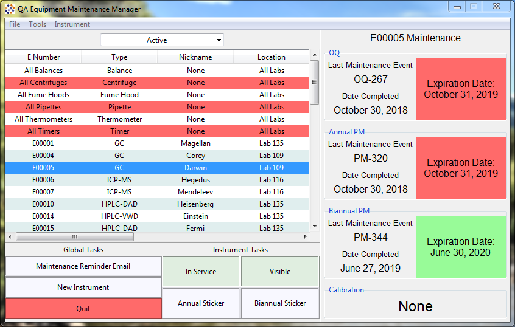

<a href="index">

</a>

## Instrument Maintenance Manager

##### for Windows



---
### Background:
Working in an analytical chemistry lab with an ISO certification, it's imperitive that instrument maintenance be performed and documented punctually. It was the responsibility of the Quality Assurance department to make sure that this was done, and I was tasked with developing a method to achieve this. Previously, several different programs had to be used together to achieve the desired results, so the goal was to develop software which fulfilled the following tasks:
* Create a [data structure](#step-1-data-structure) that allows for ease of access to data records, secure storage of records, as well as track and easily update individual instrument maintenance.
* Send out [monthly reminder emails](#step-2-monthly-email-reminder) for upcoming maintenance
* [Interface with a shared Microsoft Outlook calendar](#step-3-outlook-calendar-interface) to sync maintenance events
* Print out ISO-mandated maintenance stickers for instruments

This program is one of the most complex pieces of software that I have individually developed. I was able to simplify the overall complexity by taking advantage of python's object-oriented programming language and modularizing the overall GUI into individual frames, which made upgrades and changes much easier. The entire code is long, messy, and a bit hard to read, so for this portfolio entry, I will go over some key functions implemented in the backend without going in depth about Tkinter and the rest of the front-end.

### Development:

#### Step 1: Data Structure:
The first step was to create an easily-indexable dictionary of the instruments within the laboratory. Each instrument was created as a new instance of a class called "Equipment", which allowed the user to create an object with individual attributes for each HPLC, balance, and all of the other various equipment types.

```python
class Equipment:
    def __init__(self):
        self.equpiment_number = None
        self.hidden = False
        self.in_service = True
        self.history = {
            'OQ': history(),
            'Annual PM': history(),
            'Biannual PM': history(),
            'Calibration':history()
            }
        self.notes = ''
```
The instances were added to a dictionary in the following format,
```python
instruments = {
   'E00001': <class obj: Equipment>,
   'E00002': <class obj: Equipment>,
   ...
}
```
where they could be easily referenced by their offical equipment number (E#). Additional attributes, such as equipment type, serial numbers, and location within the building, could be optionally added to each instrument. Within the self.history attribute, an instance of each of the 4 possible maintenance types was created as the history() class, which contained the information of that instrument's maintenance history.
```python
class history:
    def __init__(self):
        self.date = None # the date of the maintenance in datetime.date format
        self.expiration = None # when the next maintenance item is due (datetime.date)
        self.analyst = None # string of who performed the maintenance
        self.number = None # each mainenance event is assigned a unique number.
```
The heart of the instrument maintenance history record information is contained in the instruments dictionary. It was serialized and pickled to a .pkl file, which was loaded each time the program opened, and saved when the user chose, and at program exit. Once this was complete, the other outlined requirements above could be accomplished.

#### Step 2: Monthly Email Reminder
With a solid data structure in hand, and the manual labor behind creating instances for each of the hundreds of pieces of equipment within the lab was complete, it was time to start automating some of the tasks that this software really aimed at simplifying. The first task I chose to tackle was simple: generate and send a monthly email reminder to a list of email addresses that contained all upcoming and overdue equipment items through a shared Outlook email account. With Outlook 2017 and Windows, this was a fairly straight-forward task. A class called Emailer was created to facilitate this event, which itself got pretty long in the code. The initialization of the class became:
```python
class Emailer:
    def __init__(self,instuments, send=False): 
        '''
        Arguments in __init__:
        instruments is a dictionary of instrument data made in step 1
        send is a boolean, true means send immediately, false means open the message and send manually
        
        The following sets up the email message
        '''
        self.send = send
        self.data = instruments
        self.date = datetime.date.today() + relativedelta(months=1, day=31) # end of next month
        self.subject = 'Upcoming Required Equipment Maintenance for {} {}'.format(calendar.month_name[self.date.month], self.date.year)
        self.get_overdue()
        self.email_body()
        self.emailer(Send=self.send)
        settings.last_email = str(datetime.datetime.today())
        settings.update()
```
Within init, several other definitions are called, the first being self.get_overdue(), which as its name implies, it searches the provided data for overdue items, and creates a dictionary sorted by duedate and type

```python
    def get_overdue(self):
        '''
        Returns self.overdue with the following data structure:
        self.overdue = {
            datetime.date:{
                object: [list of maintenance items due that duedate],
                object: [list of maintenance items due that duedate],
                },
            datetime.date:{
                object: [list of maintenance items due that duedate]
                }
            }
        '''
        
        self.overdue = {}
        for obj in self.data.values():
            if obj.in_service and not obj.hidden:
                for typ,d in obj.history.items():
                    date = d.expiration
                    if isinstance(date, datetime.date) and date <= self.date:
                        ### check if the date and type exist yet:
                        self.overdue.setdefault(datetime.date(date.year, date.month, 1),{})
                        self.overdue[datetime.date(date.year, date.month, 1)].setdefault(obj,[])
                        ### add item to overdue dict
                        self.overdue[datetime.date(date.year, date.month, 1)][obj].append(typ)
        self.overdue = dict(sorted(self.overdue.items())) #organize dict chronologically
```
Next, init calls self.email_body(), which creates the body text that will be displayed in the email by iterating through each overdue item and listing its attributes and due dates:
```python 
    def email_body(self):
        self.body = 'This is the equipment maintenance report for {} {}.'.format(calendar.month_name[self.date.month], self.date.year)
        for day,events in self.overdue.items():
            self.body += '<u>{} {}</u><br>'.format(calendar.month_name[day.month],day.year)
            for obj,items in events.items():
                s = '{} '.format(obj.equipment_number)
                if obj.nickname not in (None,'None'):
                    s += '({}) '.format(obj.nickname)
                s += '- {} in {} - {}'.format(obj.equipment_type, obj.location, items.pop(0))
                for item in items:
                    s += '/' + item
                self.body += s + '<br>'
            self.body += '<br>'
```
Finally, init calls self.emailer(), which constructs the email in Outlook and either sends it or opens the composition depending on your choice of the attribute 'Send'. It takes advantage of the windows-only module [win32com.client](https://pypi.org/project/pywin32/), and works effortlessly. 
```python
    def emailer(self):
        outlook = win32.Dispatch('outlook.application')
        mail = outlook.CreateItem(0)
        mail.To = settings.email_contacts # string of email contacts saved in settings file
        mail.CC = '' # optional email CC contact
        mail.Subject = self.subject
        mail.HtmlBody = self.body
        mail.Importance = 2
        if self.send == True:
            mail.send
        else:
            mail.Display(True)
```
The rest of the functions called in init are used to update usage information within the settings file, which is beyond the scope of this. 

#### Step 3: Outlook calendar interface
coming soon...

#### Step 4: Equipment Maintenance Sticker Generation

coming soon...
