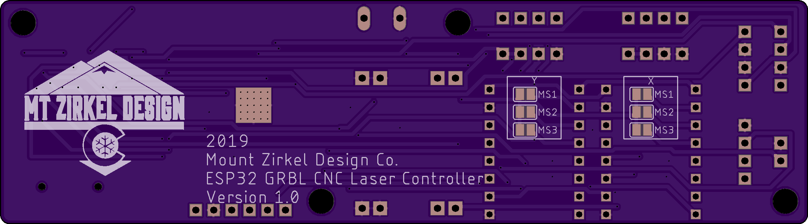

## Custom CNC Laser Cutter

---

### Background

This project began as a challenge to myself and a creative outlet, as I was interested in using it for art projects in my spare time, as a stencil cutter. I started out by buying various linear rails, stepper motors and hardware from eBay and Ali Express. Piece by piece, I assembled the CNC machine as time and finances allowed, eventually coming together as a 2-axis CNC laser with end-stops, cooling fan, and a custom built control board.

---
### Final Design

#### Technical Specifications

* 12in x 12in cutting size
* Custom GRBL-based software
* Custom ESP32-based controller board
* 1.8W 445nm M140 Laser Diode with G-2 Glass Lens (30mm)

#### Design

  

The design features a 12"x12" cutting plate, which is made from 3/8" clear acrylic. This base plate is suceptable to being cut by the laser, so a 12"x12"x1/8" replaceable plywood base is used on top of the acrylic. The base plate, which is the Y axis of the machine, is driven by a Nema 17 stepper motor and a 350mmx8mm leadscrew with anti-backlash nut. It has a total travel distance of 305mm (~12 in.)

The gantry holds the X axis and laser housing. A Nema 17 stepper motor drives a belt to guide the laser housing module along the 2 linear rails for a total travel distance of 305mm (~12 in.) Both axes have endstops at the origin to home the device and prevent the machine from crashing. Future plans include adding endstops to the far ends of the axes too. 

The laser housing is a block of 1.25"x4" milled aluminum which acts as a heatsink. 2 caps were 3D printed to allow attachment to the housing. The top cap contains an attachment for the cable drag which allows wires to reach the laser diode and fan and holds a small PCB that distributes power and signals to both devices. The bottom cap has a mounting rail to connect the drive belt and adjust the tension. It also has a hole to access the set screw that keeps the laser in place. The laser diode module is contained within a chamber cut down the center of the aluminum block.

#### Controller Board

The controller was admittedly hodge-podged together as a learning process. Prior to starting this project, I had 1 semester of electronics experience in college and not much else. Using the internet as a guide alongside trial and error, I eventually simplified the circuit to what is pictured below:

  

3 buck converters are used to step down the 24V power supply to the various power levels needed for the arduino uno, cooling fan and laser driver. Low pass filters were added just before the arduino on the limit switch inputs to eliminate noise caused by the stepper motors in shared cables. In the same module as the low pass filters, I added an input for an HC-06 bluetooth module to control the laser wirelessly. The Arduino Uno is the microcontroller of choice for this setup, since they are cheap and readily available. On top of the Uno sits a [CNC Shield V3](https://www.reprap.me/arduino-cnc-shield.html) which works with a customized version of GRBL v1.1f. This board is separate from the laser, and is connected via 2 ethernet cables and a 9V DC male-to-male cable.

#### Future Updates

* New custom ESP32 based controller board
> I have designed a new board that integrates most of the components onto a single PCB to eliminate noise, remove messy wires and reduce the overall footprint of the controller. It utilizes an ESP32-WROOM module as the microcontroller and bluetooth module in one, JST plugs for all of the I/O to clean up the wires, and has an option to use a microSD card to run a program without needing a computer connected for long cuts. Version 1 of the board is shown below.

  
   
  

* Motor controlled focus (autofocus using ToF sensor?)
> The lens on the laser has a very tight focal point. This means that materials with different thicknesses require a manual adjustment of the lens. There is some play in the threading on the lens, so adjusting the focus also moves the laser dot location, which affects repeatability. Adding a small z axis that allows the laser to move its focus up and down is ideal. Recently, I have been looking into using a time of flight sensor to autimatically adjust the laser height based on the material inside of it.

* Replace cheap linear rails with more robust V-Slot 
> V-Slot provides affordable, rigid structure that is excellent for small CNC machines. It is modular and would allow for making the workable area larger. Eventually, the entire laser cutter may be redesigned around this technology. 
