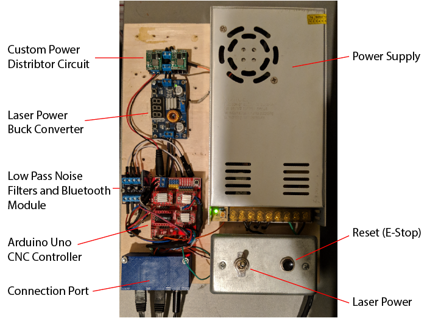

## Custom CNC Laser Cutter

---

### Background

This project began as a challenge to myself and a creative outlet, as I was interested in using it for art projects in my spare time, as a stencil cutter. I started out by buying various linear rails, stepper motors and hardware from eBay and Ali Express. Piece by piece, I assembled the CNC machine as time and finances allowed, eventually coming together as a 2-axis CNC laser with end-stops, cooling fan, and a custom built control board.

---
### Final Design

#### Technical Specifications

* 12in x 12in cutting size
* Custom GRBL-based software
* Custom ESP32-based controller board
* 1.8W 445nm M140 Laser Diode with G-2 Glass Lens (30mm)

#### Design

  

The design features a 12"x12" cutting plate, which is made from 3/8" clear acrylic. This base plate is suceptable to being cut by the laser, so a 12"x12"x1/8" replaceable plywood base is used on top of the acrylic. The base plate, which is the Y axis of the machine, is driven by a Nema 17 stepper motor and a 350mmx8mm leadscrew with anti-backlash nut. It has a total travel distance of 305mm (~12 in.)

The gantry holds the X axis and laser housing. A Nema 17 stepper motor drives a belt to guide the laser housing module along the 2 linear rails for a total travel distance of 305mm (~12 in.) Both axes have endstops at the origin to home the device and prevent the machine from crashing. Future plans include adding endstops to the far ends of the axes too. 

The laser housing is a block of 1.25"x4" milled aluminum which acts as a heatsink. 2 caps were 3D printed to allow attachment to the housing. The top cap contains an attachment for the cable drag which allows wires to reach the laser diode and fan and holds a small PCB that distributes power and signals to both devices. The bottom cap has a mounting rail to connect the drive belt and adjust the tension. It also has a hole to access the set screw that keeps the laser in place. The laser diode module is contained within a chamber cut down the center of the aluminum block.

#### Version 1 Controller

The 1st version of the controller was admittedly hodge-podged together as a learning process. Prior to starting this project in early 2015, I had 1 semester of electronics experience in college and not much else. Using the internet as a guide alongside trial and error, I eventually simplified the circuit to what is pictured below:

  

3 buck converters are used to step down the 24V power supply to the various power levels needed for the arduino uno, cooling fan and laser driver. Low pass filters were added just before the arduino on the limit switch inputs to eliminate noise caused by the stepper motors in shared cables. In the same module as the low pass filters, I added an input for an HC-06 bluetooth module to control the laser wirelessly. The Arduino Uno is the microcontroller of choice for this setup, since they are cheap and readily available. On top of the Uno sits a [CNC Shield V3](https://www.reprap.me/arduino-cnc-shield.html) which works with a customized version of GRBL v1.1f. This board was separate from the laser, and was connected via 2 ethernet cables and a 9V DC male-to-male cable. The modularity of this design allowed me to learn about how different parts interacted, and gave me the knowledge that I needed to further improve my design.

#### Version 2 Controller

I am a bit of an MCU afficianado, I own several Arduino boards, ATTinys, Teensys, amongst others, and one of my favorites, the ESP32. When I discovered that Bart Dring had [ported GRBL to the ESP32](https://github.com/bdring/Grbl_Esp32), my head was immediately filled with ideas of how to implement it into my laser. I immediately purchased his accompanying [development board](http://www.buildlog.net/blog/2018/08/grbl_esp32-cnc-development-board/), both to support his hard work, and also to dissect his board, and learn more about PCB design. Implementing this board did mean that I would need to do a major wiring overhaul. The major change that I was looking to implement was to make the circuitry small enough the be attached to the laser; no more separate controller what needed 3 separate plugs to work!

  
  

##### Major Changes:

* MCU
> The ESP32 is a 32 bit, WiFi and Bluetooth enabled (not at the same time) microcontroller that runs with a clock speed that is 15x the Arduino Uno used in the original board, and has a much smaller footprint.

* Power Supply
> The poswer supply that I used on the first version was 24V/15A. It was overkill by a mile (the cooling fan never turned on a signle time). After measuring the maximum current draw to be under 3 amps, I knew that I could find a much less bulky option. I had an old power brick from a past laptop laying around with a rated output of 19V/3.42A, with a barrel jack that mates perfectly with the one on the CNC controller board. The meat of the power supply is in-line, and doesnt need to be mounted anywhere, so it saves a lot of space.

* SD Card Reader
> The Development Board came with pins to mate an external SD card slot. This allows files to be uploaded via wifi, and accessed at any point, from any computer, tablet or phone.

* ATTiny85 Analog Level Shifter
> The ESP32 runs at 3.3V logic levels, which for the most part, interfaces fine with most 5V TTL devices. The only place that I have run into an issue is the PWM output to control laser power. The laser driver reads an analog signal and converts the level of the signal to the power output by the laser. Since the ESP32 can only output 3.3V, we're unable to reach the maximum power output, which is achieved with a full 5V TTL signal. To achieve this, a level shifter must be used. Most level shifters are digital, meaning they only output high or low. An ATTiny85 is .sed as an analog level shifter, reading the size of the 3.3V signal and outputting it to a mapped 5V signal to turn on the laser to its full power.

* Low Pass Filters
> The development board has low pass filters built in to it to remove noise from the limit switches. 

* Bluetooth Module
> While the ESP32 has capabilities for both bluetooth and WiFi, it can't do both simultaneously. I chose to run the ESP32 in wifi mode, making an easy-to-use web server that allows you to interface with the controller without any software whatsoever. The bluetooth module is added as an option to allow me to connect to the board over bluetooth serial with a program like Universal G-Code Sender. I like having options. The development board doesnt have a built in socket for this module, so I had to get creative, and use the vacant Z-Axis motor driver socket, with jumper wires to connect 3.3V, GND, RX and TX. 

#### Future Updates

* New custom ESP32 based controller board
> I have designed a new board that integrates most of the components onto a single PCB to eliminate noise, remove messy wires and reduce the overall footprint of the controller. It utilizes an ESP32-WROOM module as the microcontroller and bluetooth module in one, JST plugs for all of the I/O to clean up the wires, and has an option to use a microSD card to run a program without needing a computer connected for long cuts. Version 1 of the board is shown below.

  
   
  

* Motor controlled focus (autofocus using ToF sensor?)
> The lens on the laser has a very tight focal point. This means that materials with different thicknesses require a manual adjustment of the lens. There is some play in the threading on the lens, so adjusting the focus also moves the laser dot location, which affects repeatability. Adding a small z axis that allows the laser to move its focus up and down is ideal. Recently, I have been looking into using a time of flight sensor to autimatically adjust the laser height based on the material inside of it.

* Replace cheap linear rails with more robust V-Slot 
> V-Slot provides affordable, rigid structure that is excellent for small CNC machines. It is modular and would allow for making the workable area larger. Eventually, the entire laser cutter may be redesigned around this technology. 
